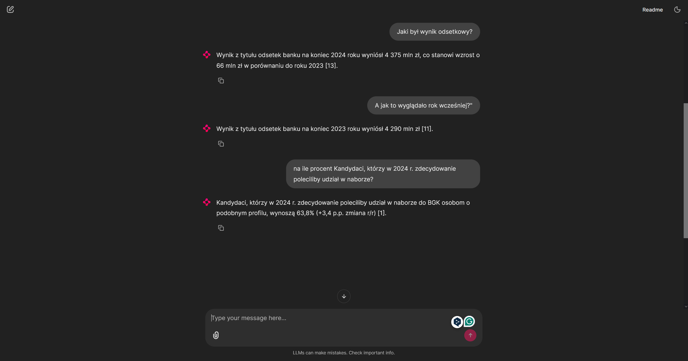

# Universal RAG Assistant (Context-Aware)


A scalable, production-ready Retrieval-Augmented Generation (RAG) system designed to interact with complex documents (such as financial reports, legal contracts, or technical manuals). 

Unlike standard "wrapper" scripts, this project implements **Clean Architecture**, separating the data ingestion pipeline from the application serving layer, and utilizes advanced asynchronous retrieval techniques.

## 🚀 Key Features

* **Universal & Domain-Agnostic**: Built to handle any PDF document. Simply drop your file into the `data/` directory.
* **Advanced Table Parsing**: Utilizes **LlamaParse** (LlamaCloud) to precisely extract complex tables into Markdown, ignoring noise like page headers, footers, and tables of contents.
* **Context-Aware Memory**: Implements a `CondenseQuestionChatEngine`. The assistant remembers the conversation history and rewrites follow-up questions for accurate vector searches.
* **Data Persistence**: Vector embeddings are permanently stored in a local **Qdrant** database via Docker Volumes. Restarting the app does not require costly re-parsing.
* **Asynchronous UI**: Built with **Chainlit** and fully async LlamaIndex clients (`achat`, `AsyncQdrantClient`) to ensure the UI remains responsive during LLM generation.

## 🛠️ Tech Stack

* **Orchestration & Framework**: LlamaIndex `v0.10+`
* **Vector Database**: Qdrant (Dockerized)
* **LLM & Embeddings**: OpenAI (`gpt-4o-mini`, `text-embedding-3-small`)
* **Parsing Engine**: LlamaParse
* **Frontend UI**: Chainlit
* **Package Management**: `pyproject.toml` (PEP 518 standard) & `Ruff` for linting

---

## ⚙️ Configuration & Setup

1. **Clone the repository.**
2. **Set up Environment Variables:**
   Copy the example environment file and fill in your API keys:
   ```bash
   cp .env.example .env
   ```
   *Required keys: `OPENAI_API_KEY` and `LLAMA_CLOUD_API_KEY`.*

3. **Provide your Data:**
   Place your target PDF document(s) inside the `data/` directory.

---

## 🏃‍♂️ How to Run (Docker)

This application is strictly divided into two distinct lifecycles: **Infrastructure/UI** and **Data Ingestion (ETL)**.

### Step 1: Start the Infrastructure
Launch the Qdrant database and the Chainlit web server in detached mode:
```bash
docker-compose up -d --build
```
*Note: The app is now running at `http://localhost:8000`, but its "memory" is empty.*

### Step 2: Ingest the Data (Build the Database)
Execute the ingestion script inside the running application container. This process reads the PDFs from the `data/` folder, parses them via LlamaParse, generates embeddings via OpenAI, and saves them permanently to Qdrant.
```bash
docker-compose exec app python src/ingest.py
```
*Wait for the `[+] Ingestion completed successfully` message.*

### Step 3: Chat with your Data
Open your browser and navigate to: **http://localhost:8000**
*(If you had the page open during Step 2, hit F5 to refresh the session and load the newly populated database).*

---

## 🔄 Updating or Changing the PDF Document

If you want to replace the current document with a completely new one (e.g., changing a 2023 report to a 2024 report) and wipe the bot's old memory, follow these steps:

1. **Stop the containers:**
   ```bash
   docker-compose down
   ```
2. **Wipe the old database:**
   Delete the locally generated `qdrant_data/` folder in the root directory. This permanently removes old vectors.
3. **Swap the files:**
   Remove the old PDF from the `data/` folder and insert your new PDF.
4. **Rebuild and Re-ingest:**
   ```bash
   docker-compose up -d
   docker-compose exec app python src/ingest.py
   ```

---

## 💻 Local Development (Without Docker)

If you wish to develop or run tests locally:

1. Start only the Qdrant database: `docker-compose up -d qdrant`
2. Create a virtual environment: `python -m venv .venv`
3. Activate it and install dependencies: `pip install -e ".[dev]"`
4. Run the ingestion locally: `python src/ingest.py`
5. Run the UI with hot-reload: `chainlit run src/app.py -w`
6. Run tests: `pytest tests/`


## 📸 Example Usage

Below is a demonstration of the Universal RAG Assistant in action. 
The system successfully retrieves exact figures from a complex 100+ page financial report and provides a generated answer backed by verifiable, interactive citations.



*Example: The assistant was asked about the interest result from the year the report was issued and the previous year, where he provided the correct results based on raport_2024_pl.pdf*